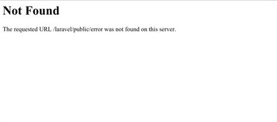

# SSL-Localhost-Setup-Mac
Run SSL certificate (https://) on local server 

Steps:
#1: Download MAMP 
Link: https://www.mamp.info/en/downloads/

#2: Find your MAMP folder (should be in finder under applications)

#3 Once in MAMP folder, go to:
/conf/apache/httpd.cong
now open this file (I Used Atom to open it, you can use any text editor, we just need to make a few changes to the file)
/conf/apache/extra/httpd-ssl.cong
now open this file, also

#4 Now you want to create an ssl folder under your user
#find the root of yours users folder (From the command line)
~
#5 Setup ssl folder

#create ssl folder
mkdir ssl

#create 'v3.ext' file
touch v3.ext

#create 'server.csr.cnf' file
touch server.csr.cnf

#6 Edit 'v3.ext'

#copy + paste below into 'v3.ext' file, and then save it

authorityKeyIdentifier = keyid, issuer
 
basicConstraints = CA:FALSE
 
keyUsage = digitalSignature, nonRepudiation, keyEncipherment, dataEncipherment
 
subjectAltName = @alt_names
 
[alt_names]
 
DNS.1 = localhost
 

#7 edit 'server.csr.cnf' file
#copy + paste below into 'server.csr.cnf' file, and then save it

[req]
 
default_bits= 2048
 
prompt= no
 
default_md= sha256
 
distinguished_name = dn
 
[dn]
 
C = CA
 
ST = ON
 
L = Ottawa
 
O = End Point
 
OU = Testing Domain
 
emailAddress = yourname@yourdomain.com
 
CN = localhost
 

#8 run more terminal commands
#This is just a listing of the commands for generating your SSL certificates
#Run these commands one at a time from inside your ~/ssl folder
#Make sure you create your server.csr.cnf and your v3.ext files first inside the same folder

#private key generation 
#This will ask you for a passphrase(password) do NOT lose this file or the password
openssl genrsa -des3 -out ~/ssl/rootCA.key 2048

#create root certificate
openssl req -x509 -new -nodes -key ~/ssl/rootCA.key -sha256 -days 1024 -out ~/ssl/rootCA.pem

#create the private key for the certificate (server.key)
openssl req -new -sha256 -nodes -out server.csr -newkey rsa:2048 -keyout server.key -config <(cat server.csr.cnf)

#generate server.crt
openssl x509 -req -in server.csr -CA ~/ssl/rootCA.pem -CAkey ~/ssl/rootCA.key -CAcreateserial -out server.crt -days 500 -sha256 -extfile v3.ext

#verify that you did everything right
openssl x509 -text -in server.crt -noout

#this should return something like this:

#you are interested in:'X509v3 Subject Alternative Name: DNS:localhost' and the 'Signature Algorithm'

#9 Now you want to edit the files you opened in step 3:
/conf/apache/httpd.cong
/conf/apache/extra/httpd-ssl.cong

#BACKUP YOUR FILES FIRST

#EDITS FOR httpd.conf

#9.1. Uncomment these lines
LoadModule ssl_module modules/mod_ssl.so
Include /Applications/MAMP/conf/extra/httpd-ssl.conf

#9.2. Change ServerName value
ServerName localhost:443

#EDITS FOR httpd-ssl.conf

#9.3. Uncomment
Listen 443

#9.4. Edit VirtualHost opening tag
<VirtualHost *:443>

#9.5. Inside VirtualHost edit these lines
  DocumentRoot "/Applications/MAMP/htdocs"
  ServerName  localhost:443
  SSLEngine on

#9.6. Add/Uncomment/Edit the two certificate lines
#make sure to change 'YOURUSERNAME' to your actual username when editing these lines
SSLCertificateFile "/Users/YOURUSERNAME/ssl/server.crt"
SSLCertificateKeyFile "/Users/YOURUSERNAME/ssl/server.key"

#10 Make a spotlight search: Keychain Access
Click 'System'
Click 'Certificates'
Click File/Import Items 
Find your ssl 'rootCA.pem' file then hit open
Double click your ssl, hit trust select: when using this certificate, then set to always trust

#11 Save files and restart MAMP Servers
#Make sure your server are setup to:
#Apache Port: 80
#MySQL Port: 3036

Now the Default MAMP website should open up, to make sure it all worked you want to change your localhost address to have 'https://'

Errors:

If you get this error it's because your DocumentRoot is incorrect you need to go: MAMP/conf/apache/extra/httpd-vhost.conf
Change DocumentRoot to  the location where you want to load your files fron '/Users/YOURUSERNAME/Documents' 

<VirtualHost *:80>
 
    DocumentRoot /Users/YOURUSERNAME/Documents
 
    ServerName localhost
 
<VirtualHost>

<VirtualHost *:80>
 
    DocumentRoot "/Users/YOURUSERNAME/Documents"
 
<VirtualHost>

And you need to go to the 'httpd.conf' and 'httpd-ssl.conf' change the DocumentRoot
